# Unreal DevTool — technical reference

> The short, friendly guide is the [README](../README.md). This page is the long version: every feature and the reasons behind the design.

A Windows desktop tool for Unreal Engine 5 developers: packages builds, regenerates Visual Studio project files, manages Git, and includes a few extras — all from one GUI.

**Highlights:** three ways to package (full UAT, compile-first with UnrealBuildTool, or restage the last cook) for Windows, Android and Linux · live progress from UAT's own stages · a **Project monitor** (processes, editor log, crash details, folder health) · **Unreal tools** (run commandlets, launch with flags, size analysis, plugins, engine versions) · failures that explain themselves · a `Ctrl+K` command palette · scheduled builds · an in-app guided manual.

> **Study & research project. Not for production.**
> Feel free to use it for testing or as a reference for your own work.

---

## A tour of the app

Everything happens on one screen that follows your build. Here it is, in the order you meet it. (The *Running* and *Finished / Failed* screens are shown with sample data so they could be captured without a 30-minute build.)

### 1. Ready — set up the build

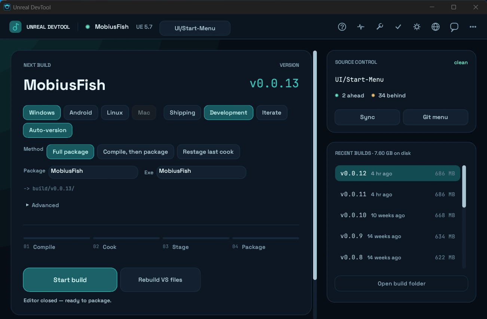

| Where | What it does |
|---|---|
| **Platform chips** (Windows · Android · Linux · Mac) | What to build for. Mac is greyed out — Unreal cannot cross-compile it from Windows. |
| **Shipping / Development**, **Iterate**, **Auto-version** | Build configuration; reuse the previous cook for a faster rebuild; auto-number the version. |
| **Method** | *Full package*, *Compile, then package*, or *Restage last cook* — see [Packaging methods](#packaging-methods). |
| **Package / Exe** | The output folder and zip name, and the game executable's name. |
| **Advanced** | Compress pak, extra UAT arguments, and *Start at* to schedule an unattended build. |
| **Start build** | The one primary action. `Ctrl+Enter` does the same. |
| **Right rail** | Source control (branch, ahead/behind, Sync) and your past builds. Click a build to open its folder; hover for how it was made. |

### 2. Running — watch it work

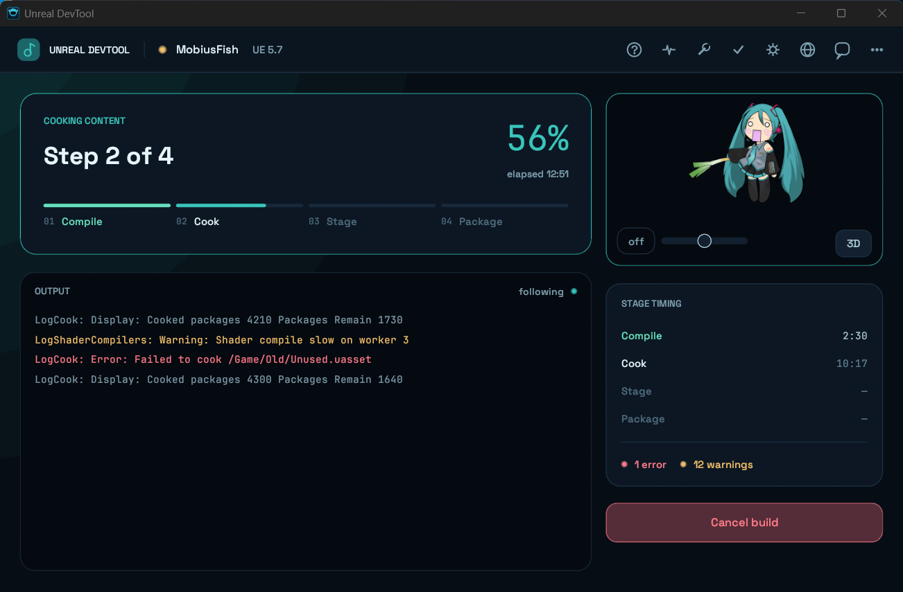

The pipeline fills from UAT's own stage banners, not a timer. The log is coloured (warnings amber, errors red) and follows the newest line. **Stage timing** and the warning and error counts update live on the right. **Cancel build** asks for a second click, so one stray click cannot end a 30-minute run.

### 3. Finished — ship it

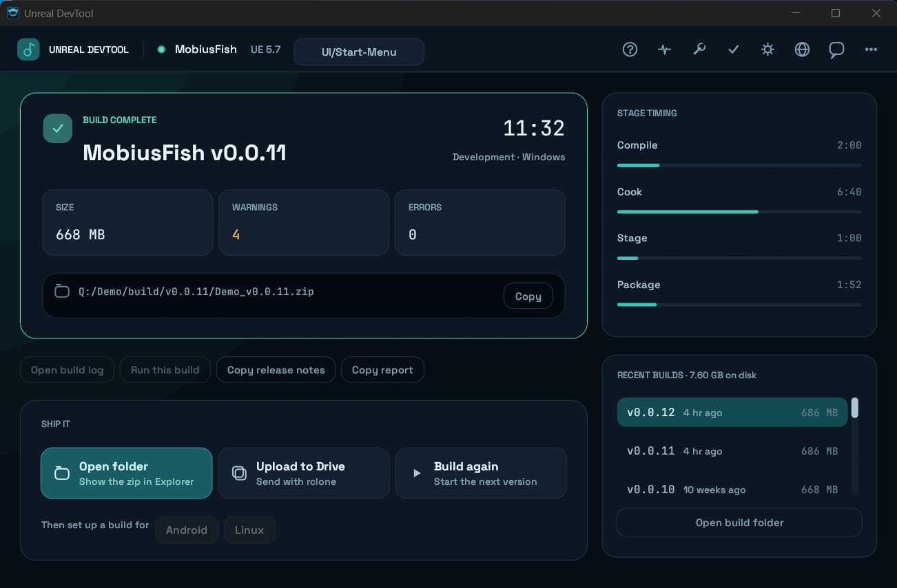

You get the size, warnings, errors, the artifact path (with **Copy**), and per-stage timing. **Open build log** and **Copy report** are always there, and **Run this build** starts a packaged Windows game. Under *Ship it*, **Then set up a build for…** switches the same project to another platform in one click.

### 3b. Failed — see why, right here

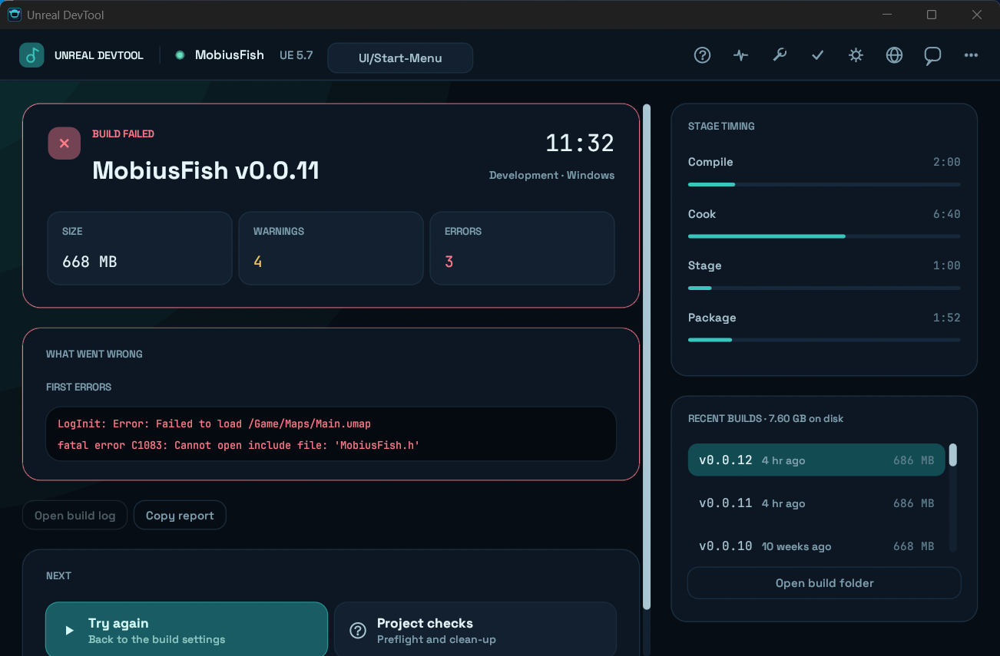

A failed build explains itself. The *What went wrong* card shows the recognised cause and its fix when the log matches a known error, plus the first errors UAT printed. Nothing is offered to ship.

### 4. Project monitor — watch the project live

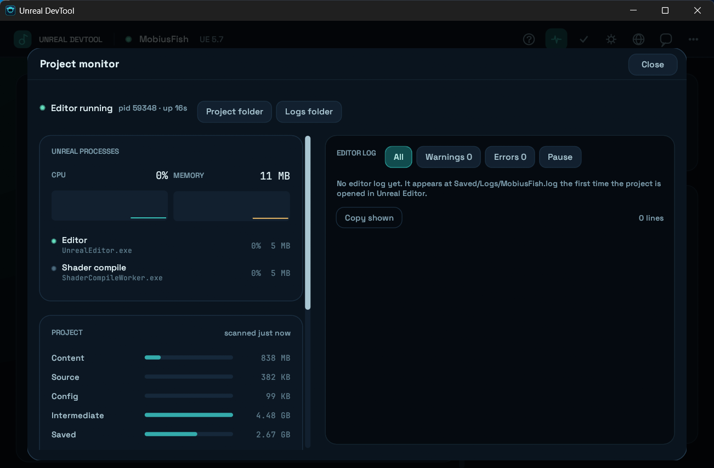

The pulse icon in the top bar opens it. **Unreal processes** shows the editor, cook, shader workers and compilers with CPU and memory; **Project** shows folder sizes, your latest edits and any crash; **Editor log** tails `Saved/Logs` live with All / Warnings / Errors filters and Pause. (The two processes in this screenshot are stand-ins started only to fill the panel.)

### 5. Command palette — do anything by typing

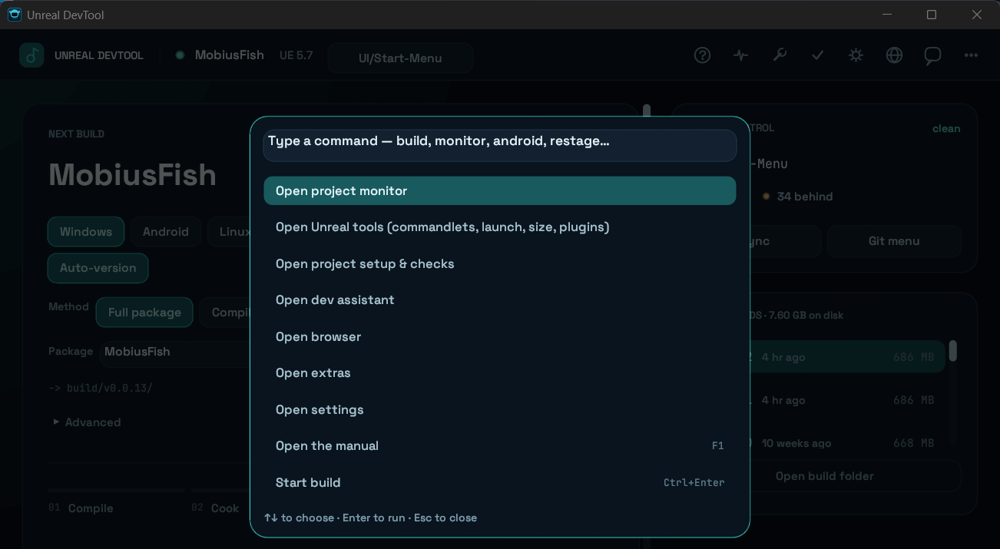

`Ctrl+K` opens it from anywhere. Type a few words — `android`, `restage`, `monitor`, `sync` — and press `Enter`. *Start build* is deliberately not the first entry, so `Ctrl+K`, `Enter` can never start a build by accident.

### 5b. Unreal tools — the jobs you would do in a terminal

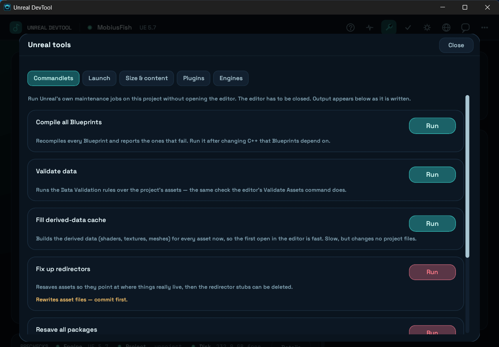

The wrench icon opens **Unreal tools**, six tabs of work that normally means a terminal or opening the editor just to click one menu:

| Tab | What it does |
|---|---|
| **Commandlets** | Runs `UnrealEditor-Cmd -run=…` for you — compile every Blueprint, validate data, fill the derived-data cache, fix up redirectors, resave packages, or any commandlet you name — with the output streamed live. |
| **Launch** | Starts the editor, the game from the editor (`-game`), or your latest packaged build, with log window / windowed / resolution / no-sound flags. The exact command line is shown first. |
| **Size & content** | Where the bytes are, by kind, folder and largest file — for the project's Content or a build — and **what grew between your last two builds**. |
| **Plugins** | Every plugin the project lists or ships, with one-click enable / disable that edits the `.uproject` (backup kept). |
| **Engines** | The installed engine versions, which one the project asks for, which one the app builds with, and a switch for each. |
| **Cheatsheet** | The console commands (`stat unit`, `viewmode wireframe`, `r.ScreenPercentage`…) and launch flags people look up again and again. Filter, click to copy. |

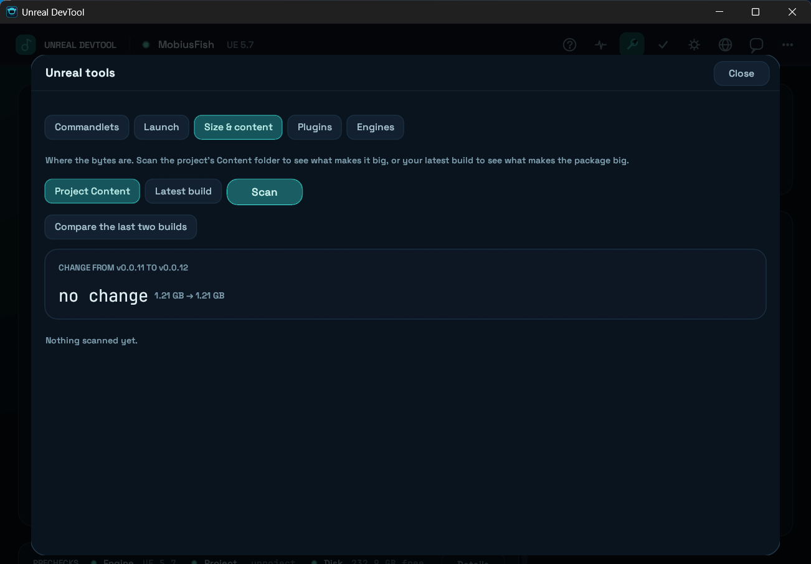

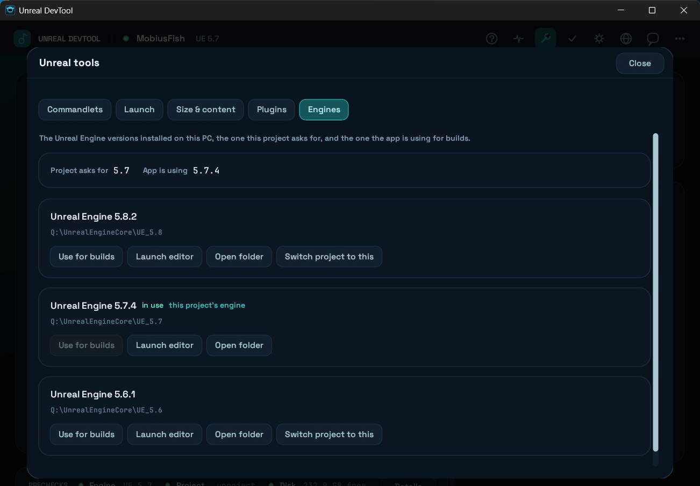

### 6. The manual — a guided tour inside the app

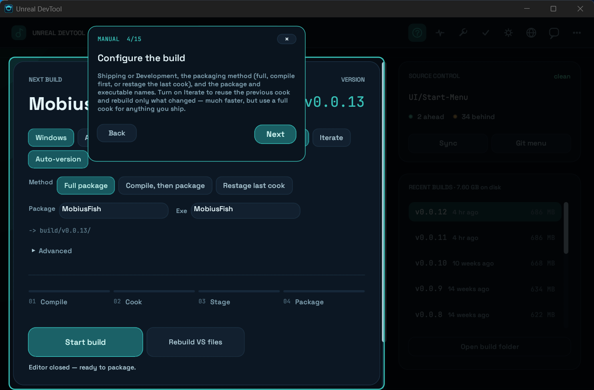

The **?** icon (or `F1`) opens a 15-step spotlight tour. Each step dims the window, points at the real control it describes, and opens the page it is about. Move with **Back / Next** or the arrow keys; `Esc` leaves.

### 7. Any window size

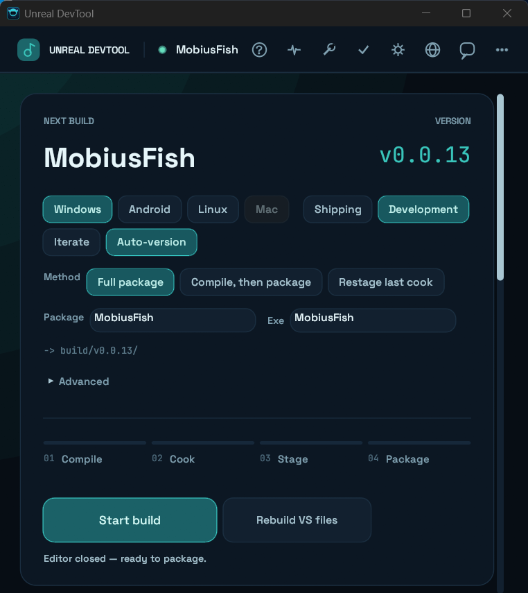

Wide windows put the build beside the rail. Narrow ones stack them into one scrolling column and fold the top bar into two rows, so nothing is clipped down to the minimum window size.

### Top-bar icons

| Icon | Opens |
|---|---|
| **?** | The manual |
| **Pulse** | Project monitor |
| **Wrench** | Unreal tools — commandlets, launch, size analysis, plugins, engines |
| **Tick** | Project setup & checks — change the project or engine, preflight results, packaging readiness, clean-up, log scanner |
| **Gear** | Settings — Miku image and sound, accent colour |
| **Globe** | Built-in browser for ChatGPT, Claude, Gemini and the Unreal docs |
| **Speech bubble** | Dev Assistant (a local LLM that is given your project as context) |
| **Dots** | Extras — visualiser, mini-games, Quick Links, self-check, Discord |

---

## UI

A short boot-log splash hands over by itself into the app's one screen.

**The main surface is the build, and it follows the job.** There are no tabs:
Ready → Running → Finished are three states of a single screen, derived from
what the work is actually doing rather than chosen from a nav.

| State | What it shows |
|---|---|
| **Setup** | Nothing is configured, so there is exactly one thing on screen: pick a `.uproject`, plus recents. |
| **Ready** | The build you are about to make — name, version, configuration as chips — an idle four-stage pipeline, one primary action, and prechecks condensed to a single line. |
| **Running** | The same surface becomes a build console: the pipeline fills per stage from UAT's own phase banners, with a live, colour-coded tail of its output. Miku moves into the rail instead of taking over the window. |
| **Finished** | The run becomes a result: size, warnings, errors, the artifact path with a copy button, per-stage timing, and three equal **Ship** actions. |

Beside it sits a **rail**: source control reduced to what you check before a
build (branch, ahead/behind, Sync/Commit), and the builds already on disk.

**There is no sidebar.** Chat, Browser, Extras, Settings, and Project setup &
checks are compact top-bar icons that open as sheets *over* the work. The `?`
icon opens the in-app manual, a 15-step spotlight tour: each step dims the
rest of the window, points an arrow at the live control it describes, and
opens the page it is about (Project checks, Assistant, Browser, Extras,
Settings). Move with **Back** / **Next** or the arrow keys; **Escape** leaves. Close a
sheet, click outside it, or press **Escape** to return to the build without
losing your place. The full git flow and post-build prompts take the surface
because each is one focused decision.

The only build action is **Start build**. It runs Unreal's UAT
`BuildCookRun` for the chosen **platform** (Windows, Android, Linux; Mac is
disabled because Unreal cannot cross-compile it from Windows) and
configuration; the live stage pipeline and log stay visible while it runs.
**Iterate** reuses the previous cook and rebuilds only what changed — much
faster, but use a full cook for anything you ship.

**The layout adapts to the window.** Wide windows show the build beside the
rail, each scrolling on its own. Below roughly 630 px the two stack into one
scrolling column, and the top bar folds into two rows, so nothing is clipped
at any size down to the 700 px minimum. Every surface keeps a fixed gutter, so a
card border never touches the window edge.

Typography is Space Grotesk for the UI and JetBrains Mono for every path,
version and log line, both bundled. egui's stock face was a large part of why
the app read as an unstyled debug tool whatever the layout did.

Motion follows Rumi's rules — only opacity and transform, on one easing curve.
The surface cross-fades and rises between states; hover, selection and the nav
rail interpolate rather than switch.

## Build results

A finished build tells you what happened without opening a log:

- **Failed builds** show *What went wrong*: the recognised cause and its fix when the log matches a known signature, plus the first error lines UAT printed. Nothing is offered to ship; you get *Try again* and *Project checks*.
- **Open build log** and **Copy report** (project, version, platform, configuration, per-stage timing, causes, first errors) are on every result.
- **The taskbar flashes** when a build finishes while the window is in the background.
- **Install on a phone** (Android builds): finds `adb` in the Android SDK's platform-tools, lists connected devices, and installs the built `.apk` with `adb install -r`. It says so plainly when `adb`, a device or the `.apk` is missing, or when the phone has not accepted the USB-debugging prompt.
- **Size budget** (*Advanced*): set the most a package should weigh; a build over it is flagged amber on the result with how far over it is.
- **Copy release notes** lists the commits made since the previous build (each build records the git commit it was made from), ready to paste into a message or a store page.
- **Cancel asks twice**, so one stray click does not end a 25-minute build.
- Each build folder gets a small `build-info.txt` (platform, configuration, duration, per-stage seconds). Hovering a build in the rail shows it, and the next run's progress bars are paced from your last successful build instead of fixed guesses.

**Advanced** (collapsed on the Ready surface): a *Compress pak* switch and a box for extra UAT arguments. Arguments must start with a dash, cannot contain shell metacharacters (`& | < > ^ %` or quotes), and cannot override options the controls already own (`-platform`, `-project`, …).

Selecting **Android** or **Linux** adds a toolchain check to the prechecks (SDK/NDK or `LINUX_MULTIARCH_ROOT`) — the most common reason a first non-Windows build fails late.

**Shortcuts and input:** `Ctrl+K` opens the **command palette** — every action in the app (sheets, platform, method, configuration, Iterate, launch the editor, open folders, sync, copy the last report) reachable by typing, with no extra buttons on any page. Type more than a command and it also offers to search the Unreal docs or forums, search the web, or hand the text to the Dev Assistant. *Start build* is deliberately not its first entry, so `Ctrl+K`, `Enter` can never start a build by accident. `Ctrl+Enter` starts a build from the Ready surface, `F1` opens the manual, and dropping a `.uproject` (or its folder) onto the window opens it.

**Scheduled builds** (*Advanced* → *Start at*): enter a time such as `23:30` and the build starts then, if the app is still open on the Ready screen. It says so in the status bar if it had to skip.

**Self-check** (Extras) shows the SHA-256 of the running executable with *Look up on VirusTotal* (a lookup by hash — the file is not uploaded), and reports any previous crash recorded in `crash.log`.

## Packaging methods

The **Method** row on the Ready surface chooses how the project is packaged. All three end in the same staged, paked and zipped folder.

| Method | What it runs | Use it when |
|---|---|---|
| **Full package** | One `RunUAT BuildCookRun` does everything: compile, cook, stage, pak, archive. | The default, and what Unreal's own Project Launcher runs. |
| **Compile, then package** | `Build.bat` (UnrealBuildTool) builds the editor target, then the game target; then UAT cooks and packages with `-skipbuild`. | You want a compile error to fail in a couple of minutes with compiler output, not 20 minutes in. Blueprint-only projects skip the compile automatically. |
| **Restage last cook** | UAT with `-skipbuild -skipcook`, re-staging what is already in `Saved/Cooked`. | Only packaging settings or staged files changed. Minutes, not a full run. It refuses to start if there is no cook for the platform. |

Every step of every method runs through the same runner, so output goes to one `BuildLog.txt`, the stage pipeline and progress work identically, and Cancel kills the whole process tree.

## Project monitor

The pulse icon in the top bar opens a live view of the project. It only reads — it never attaches to or signals the editor — and it polls only while the sheet is open.

- **Unreal processes** — editor, cook commandlet, shader workers, UBT/UAT, compiler and linker — each with CPU and memory, plus sparklines of the last couple of minutes.
- **Editor log**, tailed from `Saved/Logs/<Project>.log` as it is written, with All / Warnings / Errors filters, a **Noisiest** row of the log categories producing the most warnings and errors (click one to see only it), Pause, Copy and Open. On a large existing log it reads only the tail. Shaders left to compile and packages left to cook are pulled out of the log as live counters.
- **Project health** — folder sizes (Content, Source, Config, Intermediate, Saved, Binaries, DerivedDataCache), your latest edits and how many files changed in the last ten minutes, and the newest crash under `Saved/Crashes` — read from its `CrashContext.runtime-xml`, so the error message and the top of the call stack are on screen, with *Copy details* and *Search this error*. It also measures the **longest path once packaged** against Windows' 260-character limit. The folder scan pauses while a build is running.
- **Launch editor** opens the project with the detected engine's `UnrealEditor.exe`.

## Unreal tools

The wrench icon (or `Ctrl+K` → *Open Unreal tools*).

- **Commandlets** run `Engine/Binaries/Win64/UnrealEditor-Cmd.exe <project> -run=<Name> … -unattended -nopause -stdout` with the output written to `Saved/Logs/DevTool_<name>.log` and tailed on screen (warnings amber, errors red, Cancel kills the whole process tree). The editor must be closed, and only one run goes at a time. *Fix up redirectors* and *Resave all packages* rewrite assets, so they ask for a second click and say "commit first".
- **Launch** never hides anything: the command line is displayed before you press Launch. Extra arguments must start with a dash and cannot contain shell metacharacters.
- **Size & content** scans on a background thread with a time limit (it reports a partial result rather than stalling). *Compare the last two builds* lists what grew or shrank by kind, by folder and by file, including files that appeared or vanished.
- **Plugins** rewrites the `.uproject` keeping key order and Unreal's tab indentation; the first change saves `<project>.uproject.devtool-backup`. It refuses to edit while the editor is open.
- **Cheatsheet** is a searchable list of about fifty everyday console commands and command-line flags. Click one to copy it; the `Ctrl+K` palette finds them too (`Copy: stat unit`).
- **Engines** lists installs from the registry, custom builds and sibling folders of engines in use, reading each one's real version from `Build.version`. *Switch project to this* edits `EngineAssociation` (with a backup and a two-click confirm) — the assets are converted the next time the project opens in that engine, so commit first.

## Packaging readiness

*Project setup & checks* also lists problems in the project's own config that break or spoil a package: an unreadable `.uproject`, a code project with no `Source` folder, no default map (or one that does not exist under `Content`), and — when building for Android — the template package name `com.YourCompany.[PROJECT]`. The prechecks strip shows a count. Inside a git repository it also checks that `Intermediate`, `Saved`, `DerivedDataCache` and `Binaries` are in `.gitignore`. Where the app can be sure what to change, the check has a **fix button** — set the only (or obviously named) map as the default, or append the missing folders to `.gitignore` — which says exactly what it will do and keeps a `.devtool-backup` of any file it edits. After a successful build, the result offers one click to set up the same project for another platform.

## Quick Links

Fully user-editable — open **Extras → Quick Links**, then click **Edit** to
rename, retarget, add, or remove any of them; changes save immediately to
`links.json`. Seeded by default with Claude, ChatGPT, Gemini, Epic Games, and
the Unreal docs assistant (real URLs), plus Trello, Jira, Task List, and
Requirement Check (empty URL — there's no universal default for a team's own
board/doc, so these start unset). Clicking a link with no URL set opens the
editor instead of navigating nowhere.

---

## The space-in-path bug (and its fix)

Unreal's own UAT/UBT batch scripts have a long-standing bug with spaces in paths — most commonly hit via the *default* Epic Games Launcher install location (`C:\Program Files\Epic Games\UE_5.x`), or a project folder with a space in its name. It shows up as a cryptic `'C:\Program' is not recognized as an internal or external command` failure, often after a long build.

Check PC Setup (and the config panels for Package/Rebuild VS Files) detect this and offer a one-click **Fix automatically**: it creates an NTFS directory junction aliasing the affected folder(s) to a space-free path (`C:\UEDevToolLink\...` or `%ProgramData%\UEDevToolLink\...`) and routes UAT/UBT invocations through that instead. Nothing is moved or copied — the junction is just an alternate, space-free path to the same folder. Once applied, it's used for both packaging and VS Rebuild for the rest of the session.

---

## Package versions

Choose **Development** for a debug-friendly test build or **Shipping** for an optimized release build. The last used configuration and platform are remembered per project and passed to Unreal's UAT client and server configuration flags.

Versions auto-increment as `v0.0.1`, `v0.0.2`, … based on existing build folders. You can also enter a custom version before packaging. The version string is validated — it cannot be empty or contain characters that are illegal in Windows file names (`\ / : * ? " < > |`).

---

## Sync with main

"Sync with main" is fully automatic:
1. `git fetch origin main`
2. `git rebase origin/main`
3. `git push --force-with-lease origin <current-branch>` (or a regular push if already on main/master)

No manual pull or push needed after clicking the button.

---

## Auto update check

The app checks GitHub for a newer release on startup and then every 5 minutes while running. If a new version is found, a banner appears immediately. No restart needed to see the update prompt.

Installing an update renames the running exe aside and drops the new one in its place (Windows allows renaming a running executable — it only blocks deleting one without `FILE_SHARE_DELETE`), then relaunches. Both that rename and the later cleanup of the old exe retry with backoff, since antivirus real-time scanning commonly grabs a freshly-written `.exe` for a moment right after it's closed. If the app is installed somewhere without write access (e.g. under `C:\Program Files\...` without admin rights), the update fails fast with a clear message instead of a cryptic OS error — App Self-Check surfaces this too.

---

## Project layout

```
src/
  main.rs         entry point, window setup
  app.rs          DevToolApp state + all non-UI action methods
  ui/             egui panels (one module per feature area)
    mod.rs          frame/update loop and surface routing
    shell.rs        top bar, sheets, and overlay controls
    intro.rs         boot-log splash screen
    setup.rs          first-run project picker and recent projects
    run.rs            Ready/Running/Finished build surface
    rail.rs           build context, source control, and recent-build rail
    dashboard.rs      project setup and preflight diagnostics sheet
    package.rs        upload panel and post-package prompts
    vs.rs             Visual Studio rebuild configuration panel
    git.rs            Git flow panels
    chat.rs           Dev Assistant sheet
    browser.rs        embedded browser sheet
    guide.rs          in-app manual (spotlight tour across pages)
    monitor.rs        Project monitor sheet
    palette.rs        command palette (Ctrl+K)
    tools.rs          Unreal tools sheet
    panels.rs         upload / open-folder / web panels shared by surfaces
    extras.rs         Extras sheet, Quick Links, Miku, and games
    bar_chart.rs      Git activity chart
    preflight.rs      PC checks and space-fix warning box
    selfcheck.rs      App Self-Check panel (an Extras sub-tab)
  ops/            everything that isn't UI — file/process/network work
    package.rs       packaging methods (UAT / UBT + UAT / restage), step runner, in-process zip, upload
    monitor.rs       live process, editor-log and project-folder monitor
    tools.rs         commandlet runner and launch arguments
    cheatsheet.rs    console commands and launch flags reference
    adb.rs           Android device list and APK install
    insights.rs      size breakdown and build-to-build comparison
    plugins.rs       .uproject plugin list and engine-association editing
    engines.rs       installed engine versions
    crash.rs         crash report parsing
    clock.rs         local time of day, for scheduled builds
    doctor.rs        packaging-readiness checks on the project's config files
    run.rs           live UAT log tail and stage detection
    history.rs       past builds on disk (size, age)
    clean.rs         regenerable-folder cleanup
    rclone.rs        rclone detection for uploads
    vs.rs            GenerateProjectFiles.bat / Build.bat
    git.rs           git plumbing
    preflight.rs      space-in-path fix, disk space, PC-setup checks
    diagnostics.rs    known-error signature table, build-log scanner
    llm.rs            Ollama / LM Studio client (provider detection, streaming chat)
    selfcheck.rs      app-itself diagnostics
    update.rs         GitHub release check, self-update, old-binary cleanup
    discord.rs        opens Discord via its URL handler (no scripting)
  engine.rs       Unreal Engine detection (registry / EngineAssociation)
  config.rs       all persisted settings (%APPDATA%\UnrealDevTool)
  types.rs        shared enums (GitState, IdeChoice, ...)
  theme.rs        colors, accent color persistence
  audio.rs, gif.rs, webview.rs   media playback, embedded WebView2 panels
```

---

## Releasing

Releases are automatic. Every push to `main` runs the *Build and Release* workflow, which numbers the release itself: `Cargo.toml` holds the series (`MAJOR.MINOR`, currently `1.0`), and the patch is the highest existing tag in that series plus one — so pushes give `v1.0.2`, `v1.0.3`, and so on. The bumped number exists only inside that build; nothing is committed back, so a release can never trigger another release. To start a new series, change the version in `Cargo.toml` (for example `1.1.0`): the first release of a series uses the patch written there.

The in-app updater compares whole versions (major, minor, patch), so `v1.0.2` correctly counts as newer than `v1.0.1` and than the old `v0.0.<n>` builds, and existing installs are offered it.

---

## Regenerating the screenshots

The images in `docs/images/` come from a **debug** build, which accepts a `UDT_DEMO` environment variable so a screen can be opened without doing the work that produces it: `ready`, `running`, `ok`, `android`, `failed`, `monitor`, `checks`, `extras`, `palette`, `guide`, or a tools tab (`tools`, `tools-launch`, `tools-content`, `tools-compare`, `tools-plugins`, `tools-engines`, `tools-cheat`, `tools-run`). For example:

```powershell
$env:UDT_DEMO = "running"; cargo run
```

The switch does not exist in release builds. Crop the window border and the status bar (it shows local paths) before committing new images.

---

## Build

**Debug** — run directly on Windows:
```powershell
cargo run
```

**Release** — build from WSL2:
```bash
sudo mkdir -p /mnt/q && sudo mount -t drvfs Q: /mnt/q
cd /mnt/q/Rust/DevTool
bash build.sh
```
Output: `WSL2 Build/x86_64-pc-windows-gnu/release/unreal_devtool.exe`

**Release via CI** — push to `main`, GitHub Actions builds and publishes the `.exe` automatically.

---

## Google Drive upload (rclone)

Uploads use [rclone](https://rclone.org/) — install it once and configure a remote named `gdrive` (or any name you choose):

```powershell
rclone config
```

Follow the prompts: select **Google Drive**, paste your OAuth Client ID and Secret from [Google Cloud Console](https://console.cloud.google.com/), then link your account in the browser tab that opens. Once done, enter a destination in the upload panel:

```
gdrive:/Builds/MyGame
```

**This app does not ship, download or install rclone.** It only looks for one
you installed yourself, in this order: a copy left in
`%APPDATA%\UnrealDevtool\rclone\` by an older build, then an `rclone.exe`
sitting next to the app, then your `PATH`.

When none is found, the **Google Drive upload** section on the Package page (and
the post-build upload panel) shows a single button that opens
<https://rclone.org/downloads/>, followed by the numbered one-time setup above.
Drop `rclone.exe` on your `PATH` or next to this app's `.exe` and restart.

The remote name must match the prefix you used in the destination field.

If an upload fails (expired auth, no permission on the destination, network blocked, etc.), the Status/Output box shows rclone's actual error and a fallback panel offers to open the build folder and Google Drive in your browser for a manual upload, or retry.

---

## Requirements

- Windows 10/11
- [WebView2 Runtime](https://developer.microsoft.com/en-us/microsoft-edge/webview2/) (pre-installed on Windows 11; free download for Windows 10) — required for Cookie Clicker, 3D Miku, and Sponder Bird embedded panels
- [Ollama](https://ollama.com/) and/or [LM Studio](https://lmstudio.ai/) — optional, only needed for the Dev Assistant chat panel. Neither is bundled; the app just looks for one running locally

---

## Notes

- Config and build names are saved to `%APPDATA%\UnrealDevTool\`
- WebView2 persistent data (Cookie Clicker save, etc.) stored in `%APPDATA%\UnrealDevTool\webview2\`
- Engine detection reads `EngineAssociation` from the `.uproject` file to find the exact matching engine version; a manually-picked engine folder (via Browse…) persists across restarts and always wins over auto-detection until cleared
- Force push to main is intentionally not implemented
- The exe is fully portable — no installer or runtime needed (WebView2 aside)
- rclone is neither bundled nor downloaded — you install it yourself and the app links you to it. It used to be compiled into the binary, which made the download ~97 MB; it is now ~18 MB

---

## Antivirus false positives

Windows Defender and other engines sometimes flag this app. It is a false positive, and the causes are understood.

**What was fixed.** The binary used to embed a full 79 MB copy of `rclone.exe` in its data section with `include_bytes!`, write it to `%APPDATA%` on first use, and execute it. That is, behaviourally and structurally, a textbook dropper — an executable carrying a packed executable payload that it unpacks to disk and runs — and it is the strongest signal any scanner could have picked up here. rclone is also dual-use (ransomware crews use it to exfiltrate data) and is itself detected as riskware by several vendors, so the embedded copy was flagged *inside* our binary before it was ever extracted. The app no longer ships, downloads or installs rclone at all — it links to rclone.org and you install it yourself, so the one process that writes an executable to your machine is your own deliberate act. That alone took the executable from ~97 MB to ~18 MB; an unsigned 97 MB binary draws suspicion on size alone.

**Second round: no scripts, no keystrokes.** Three more behaviours that look like malware to a scanner were removed:

- **Discord.** The composer used to write a PowerShell script to `%TEMP%`, run it hidden with `-ExecutionPolicy Bypass`, and use `SendKeys` to type into Discord. A dropped script, a hidden interpreter with the policy bypassed and synthetic keystrokes into another application together are the classic keylogger/RAT shape. It now opens Discord through its URL handler and puts your message on the clipboard for you to paste.
- **Zipping.** Builds were zipped by launching `powershell Compress-Archive`. They are now zipped in-process (deflate, zip64), which is also faster to start, works on files over 4 GB, and can be cancelled mid-archive.
- **Disk space.** Read by spawning PowerShell; now a direct `GetDiskFreeSpaceExW` call.

The app no longer starts PowerShell for anything. The Project monitor reads other processes only in the way Task Manager does: `tasklist` for the list, and a read-only `PROCESS_QUERY_LIMITED_INFORMATION` handle (CPU time, start time) for processes whose names are on a short Unreal-only list. It does not read their memory, inject into them, or signal them, and it runs only while the monitor is open. The Unreal tools only start Unreal's own executables (`UnrealEditor-Cmd.exe`, `UnrealEditor.exe`, your packaged game) when you press a button, with the arguments shown. What it still launches, all in response to a click or a poll: `git`, `tasklist`/`taskkill` (only for Unreal Editor and UAT), `explorer`, `cmd /c mklink /J` (the space-in-path fix) and Unreal's own `RunUAT.bat`.

Alongside that, the build now embeds a **version resource** (ProductName, FileDescription, CompanyName, OriginalFilename) and an **icon**, so the binary is no longer an anonymous blob in Explorer and to reputation scoring, and an **application manifest** declaring `asInvoker` — without one, Windows applies installer-detection heuristics and may treat the app as wanting elevation. Debug info is stripped but the symbol table is kept, since a fully stripped unsigned binary reads as deliberately obfuscated. Releases now publish a `.sha256` sidecar, and the in-app updater verifies the download against it before installing.

**What is still missing: a code signing certificate.** None of the above establishes *who* published the binary — only an Authenticode signature does that, and it is the only real fix for SmartScreen's "unrecognised app" warning. The release workflow has a signing step ready to go; it stays skipped until the secrets exist. To enable it, buy a code signing certificate (an OV certificate runs roughly $100–300/year; an EV certificate costs more but gets SmartScreen reputation immediately rather than accruing it over time), then base64-encode the `.pfx` into a `WINDOWS_CERT_BASE64` repository secret with its password in `WINDOWS_CERT_PASSWORD`.

**Verifying a download.** Every release lists its SHA-256 and ships a `.sha256` file:

```powershell
Get-FileHash unreal_devtool.exe -Algorithm SHA256
```

If it matches the release, the binary is exactly what CI built. If an engine still flags it, report it as a false positive to the vendor — Microsoft's form is at <https://www.microsoft.com/en-us/wdsi/filesubmission>.

---

## License

MIT License

Copyright (c) 2026 NickTam

Permission is hereby granted, free of charge, to any person obtaining a copy of this software and associated documentation files (the "Software"), to deal in the Software without restriction, including without limitation the rights to use, copy, modify, merge, publish, distribute, sublicense, and/or sell copies of the Software, and to permit persons to whom the Software is furnished to do so, subject to the following conditions:

The above copyright notice and this permission notice shall be included in all copies or substantial portions of the Software.

THE SOFTWARE IS PROVIDED "AS IS", WITHOUT WARRANTY OF ANY KIND, EXPRESS OR IMPLIED, INCLUDING BUT NOT LIMITED TO THE WARRANTIES OF MERCHANTABILITY, FITNESS FOR A PARTICULAR PURPOSE AND NONINFRINGEMENT. IN NO EVENT SHALL THE AUTHORS OR COPYRIGHT HOLDERS BE LIABLE FOR ANY CLAIM, DAMAGES OR OTHER LIABILITY, WHETHER IN AN ACTION OF CONTRACT, TORT OR OTHERWISE, ARISING FROM, OUT OF OR IN CONNECTION WITH THE SOFTWARE OR THE USE OR OTHER DEALINGS IN THE SOFTWARE.

---

## Credits

- **Loading animation** — [Ievan Polkka's Hachune Miku Vector (animated)](https://www.deviantart.com/duckne55/art/Ievan-Polkka-s-Hachune-Miku-Vector-animated-451345694) by [duckne55](https://www.deviantart.com/duckne55) on DeviantArt. All rights belong to the original artist.
- **Packaging music** — "Ievan Polkka" from *Hatsune Miku: Project DIVA F Complete Collection*, sourced from [Khinsider](https://downloads.khinsider.com/game-soundtracks/album/hatsune-miku-project-diva-f-complete-collection/2-21.%2520Ievan%2520Polkka.mp3). All rights belong to the original copyright holders.
